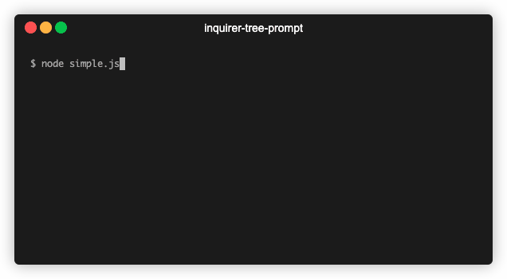

## Inquirer Tree Prompt

Code base forked from [inquirer-tree-prompt](https://github.com/insightfuls/inquirer-tree-prompt)

### QuickDemo


### Install
```
npm install inquirer-tree-prompt
```

Requires Node.js >= 26 and `@inquirer/core` >= 10 as a peer dependency.

### Usage
The prompt is a standalone `@inquirer/core` prompt: call it directly and await
the answer.

```js
import { treePrompt } from 'inquirer-tree-prompt';

const answer = await treePrompt({
    message: 'Where is my phone?',
    tree: [/* ... */],
});
```

### Options
Takes `message`, `tree`, [`filter`, `validate`, `transformer`, `pageSize`, `loop`, `onlyShowValid`, `hideChildrenOfValid`, `multiple`] properties.

- `message`: (String) the question to display.

- `tree`: (Array or Function) list of tree items, or an (optionally asynchronous) function returning them; items are strings or objects with:
  - `name`: (String) to display in list; must provide this or `value`. It may span several lines: the extra lines are indented under the first one and count towards `pageSize`
  - `value`: (String) to put in answers hash; must provide this or `name`
  - `short`: (String) to display after selection
  - `open`: (Boolean) whether the item is expanded or collapsed
  - `isValid`: (Boolean) skips `validate` for this item
  - `multiple`: (Boolean) whether this item's children may be selected together (only meaningful when the prompt is in `multiple` mode); children are mutually exclusive by default
  - `children`: (Array or Function) list of child tree items, or an (optionally asynchronous) function returning them. The function may return a list of children, or a replacement item (`{ name, value, short, children }`) when the item itself has to be updated once resolved.

- `validate`: (Function) receives an item's value, returns (or resolves to) whether it may be selected. Invalid items are shown in red and cannot be confirmed.

- `onlyShowValid`: (Boolean) if true, will only show valid items (if `validate` is provided); items with children are kept since they may contain valid descendants. Default: false.

- `hideChildrenOfValid`: (Boolean) if true, will hide children of valid items (if `validate` is provided). Default: false.

- `transformer`: (Function) a hook function to transform the display of item's value (when `name` is not given).

- `filter`: (Function) receives the answer (a value, or an array of values in `multiple` mode) and returns (or resolves to) the value to answer with.

- `multiple`: (Boolean) if true, will enable to select multiple items. Default: false.

- `pageSize`: (Number) number of **rows** displayed at once. Default: 10. A name spanning several lines takes that many rows off the page, and the page is capped to the height of the terminal so the highlighted item always stays visible.

- `loop`: (Boolean) if true, moving past the last item wraps around to the first. Default: true.

### Keys
- `up` / `down`: move through the visible items
- `right`: expand the item, or move to its first child when already expanded; toggles selection on a leaf in `multiple` mode
- `left`: collapse the item, or move to its parent
- `space`: toggle selection in `multiple` mode, otherwise expand or collapse
- `tab`: expand or collapse
- `enter`: confirm

### Example
```js
import { treePrompt } from 'inquirer-tree-prompt';

const answer = await treePrompt({
    message: 'Where is my phone?',
    tree: [
        {
            value: "in the house",
            open: true,
            children: [
                {
                    value: "in the living room",
                    children: [
                        "on the sofa",
                        "on the TV cabinet"
                    ]
                },
                {
                    value: "in the bedroom",
                    children: [
                        "under the bedclothes",
                        "on the bedside table"
                    ]
                },
                "in the bathroom"
            ]
        },
        {
            value: "in the car",
            // resolved the first time the item is expanded
            children: async () => [
                "on the dash",
                "in the compartment",
                "on the seat"
            ]
        }
    ]
});

console.log(answer);
```

### Examples
The [`example`](./example) directory has one runnable script per option; each is a
standalone prompt, run it with `node example/<file>.js`.

| Example | Covers |
| --- | --- |
| [`items.js`](./example/items.js) | item properties: bare strings, `name`, `value`, `short`, `open`, multiline names |
| [`tree.js`](./example/tree.js) | `tree` as an async function, lazy `children`, a `children` function replacing its own item, and one that fails |
| [`validate.js`](./example/validate.js) | `validate`, and `isValid` to opt an item out of it |
| [`onlyShowValid.js`](./example/onlyShowValid.js) | `onlyShowValid`: hide the items `validate` rejects |
| [`hideChildrenOfValid.js`](./example/hideChildrenOfValid.js) | `hideChildrenOfValid`: make valid items leaves |
| [`transformer.js`](./example/transformer.js) | `transformer`: display nameless values differently |
| [`filter.js`](./example/filter.js) | `filter`, single and multiple selection, synchronous and asynchronous |
| [`multiple.js`](./example/multiple.js) | `multiple` on the prompt and on individual items |
| [`pageSize.js`](./example/pageSize.js) | `pageSize` counting rows rather than items |
| [`loop.js`](./example/loop.js) | `loop: false` versus the default |
| [`simple.js`](./example/simple.js) | a whole menu putting several options together |

### Development
```
npm test    # node:test, no extra dependency
npm run lint
```
